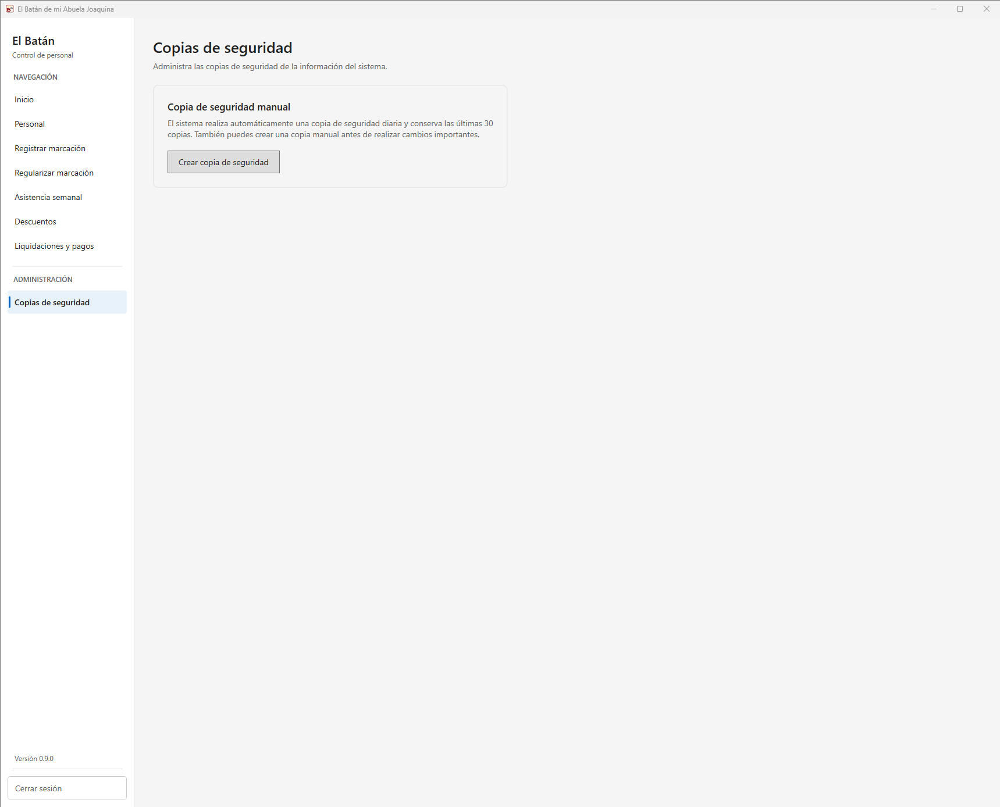
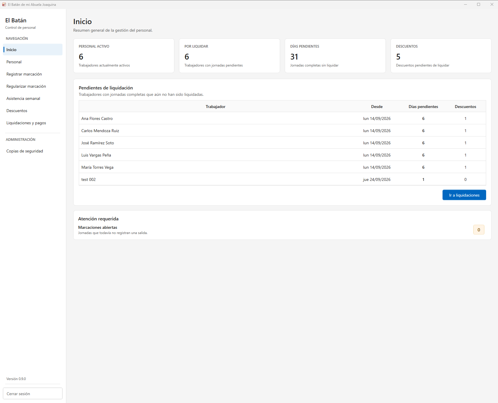
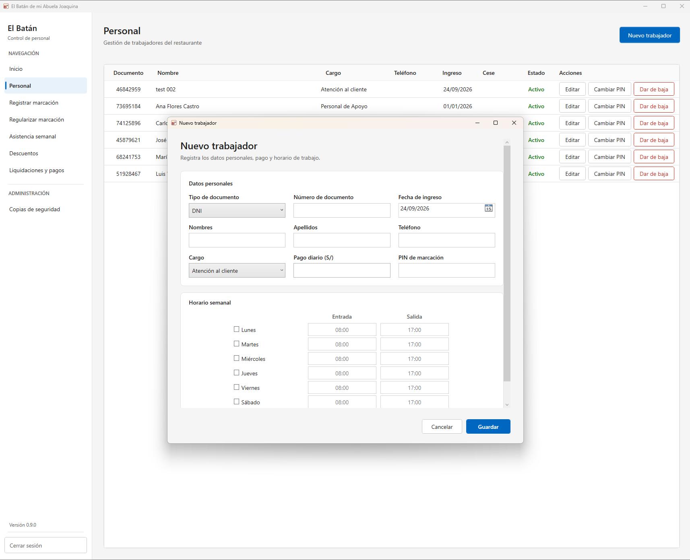
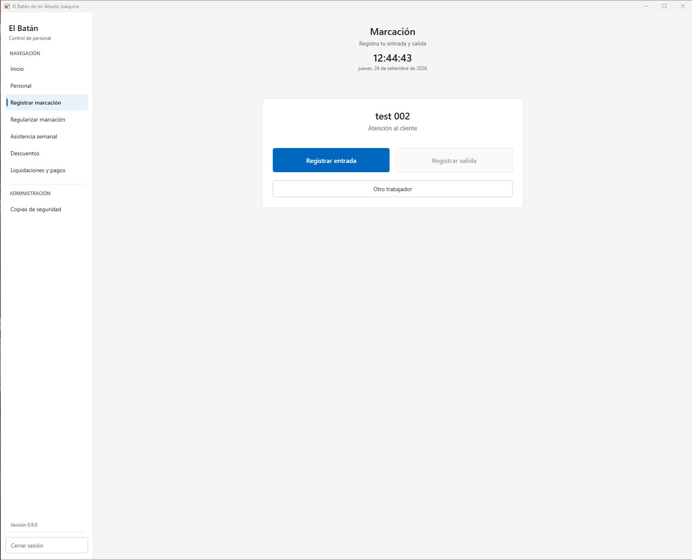
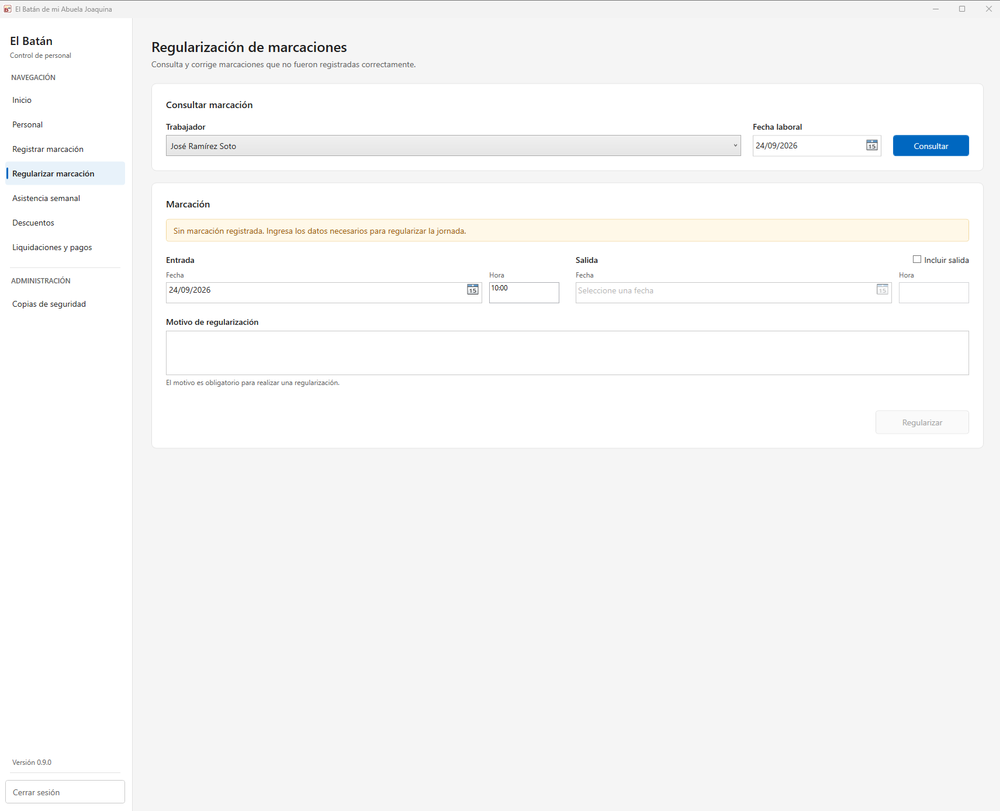
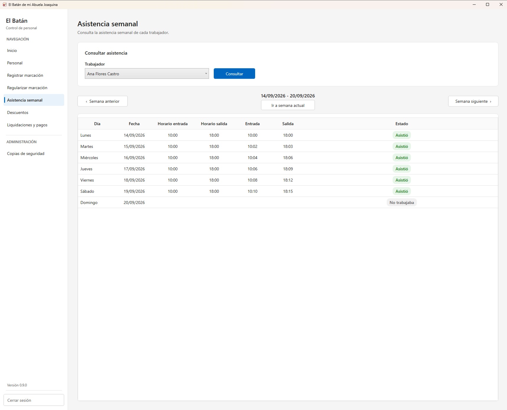
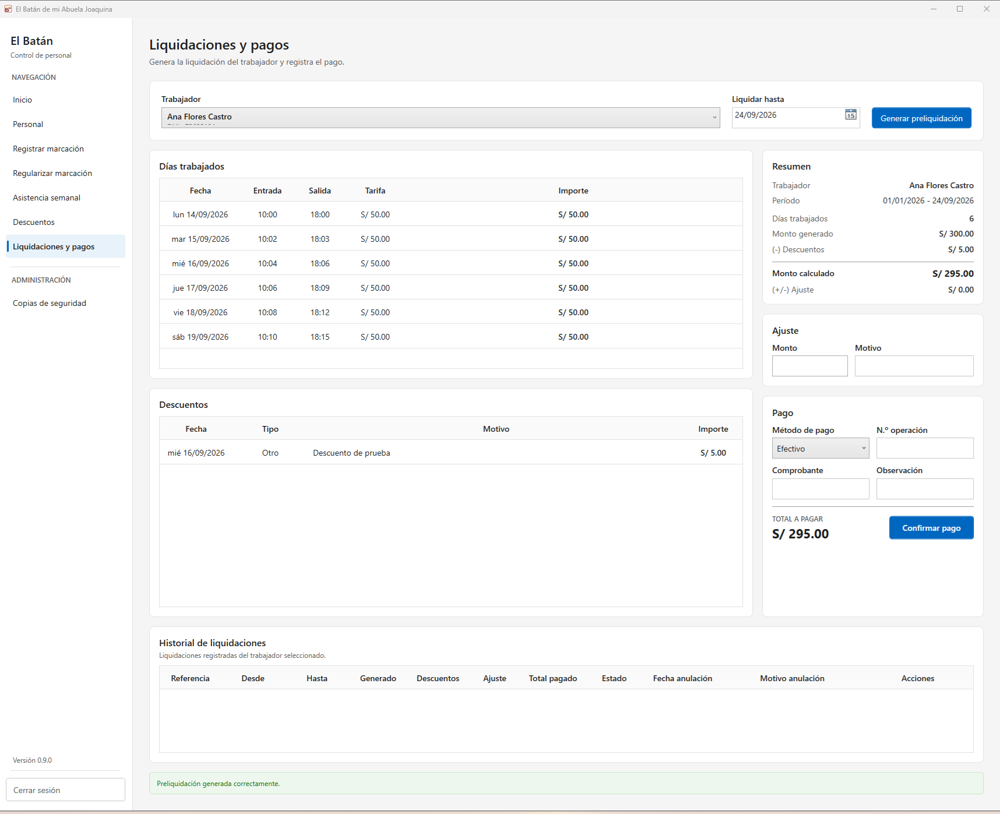

# El Batán - Control de Personal

> Aplicación de escritorio para digitalizar la gestión de personal de un
> pequeño negocio, diseñada desde el análisis del problema hasta su
> distribución y puesta en marcha.

**.NET 8** · **WPF** · **EF Core** · **SQLite** · **xUnit** · **Inno
Setup**

**Estado:** `v0.9.0` · Marcha blanca

------------------------------------------------------------------------

## 🎯 El problema

El negocio necesitaba centralizar procesos que forman parte de la
operación diaria del personal:

-   Gestión de trabajadores e historial laboral.
-   Marcaciones de entrada y salida.
-   Regularización y consulta de asistencia.
-   Descuentos.
-   Liquidaciones.
-   Control de acceso por roles.

El sistema debía funcionar inicialmente en **un único equipo Windows**,
sin depender permanentemente de Internet y manteniendo protegida la
información ante actualizaciones de la aplicación.

------------------------------------------------------------------------

## 🏗️ La decisión de arquitectura

Una de las decisiones principales fue **no sobredimensionar la
solución**.

El contexto no justificaba una API independiente, microservicios,
contenedores ni infraestructura cloud.

Se optó por:

``` text
                    ┌───────────────┐
                    │    Desktop    │
                    │   WPF / MVVM  │
                    └───────┬───────┘
                            │
                    ┌───────▼───────┐
                    │  Application  │
                    │ Casos de uso  │
                    └───────┬───────┘
                            │
                    ┌───────▼───────┐
                    │    Domain     │
                    │ Reglas negocio│
                    └───────────────┘

                      Infrastructure
                     EF Core · SQLite
                  Persistencia · Backups
```

`Application` no depende de Entity Framework Core. Las necesidades de
persistencia, seguridad, identidad y tiempo se expresan mediante
abstracciones implementadas desde Infrastructure.

La intención fue mantener una arquitectura **simple para operar, pero
preparada para evolucionar**.

------------------------------------------------------------------------

## ⚖️ Decisiones y trade-offs

  -----------------------------------------------------------------------
  Decisión                Motivo                  Trade-off
  ----------------------- ----------------------- -----------------------
  WPF                     Aplicación utilizada    Dependencia de Windows
                          localmente en Windows   

  SQLite                  Un único equipo y       Reevaluar si aparece
                          operación offline       concurrencia
                                                  multiusuario

  Sin API                 No existía necesidad de El acceso remoto futuro
                          clientes remotos        requerirá evolución

  Arquitectura por capas  Separar negocio de UI e Mayor estructura
                          infraestructura         inicial

  EF Core Migrations      Evolucionar sin recrear Requiere controlar las
                          datos reales            actualizaciones

  Backups pre-migración   Proteger información    Mayor responsabilidad
                          antes de modificar el   durante el inicio
                          esquema                 
  -----------------------------------------------------------------------

------------------------------------------------------------------------

## 🛡️ Diseñando para datos reales

Una parte importante del proyecto apareció al pasar de **"una aplicación
que funciona"** a **"una aplicación que debe conservar información
real"**.

Se incorporaron:

-   Migraciones controladas con EF Core.
-   Backups automáticos, manuales y previos a migraciones.
-   Cancelación de la migración si no puede protegerse previamente la
    base de datos.
-   Persistencia independiente del directorio de instalación.
-   Actualizaciones que conservan los datos existentes.
-   Aplicación de instancia única para evitar múltiples procesos sobre
    la misma SQLite.
-   Versionado mediante Git tags y Releases.
-   Instalador versionado mediante Inno Setup.

El flujo de actualización quedó conceptualmente así:

``` text
Nueva versión
     ↓
¿Migración pendiente?
     ↓
Backup pre-migración
     ↓
Migración
     ↓
Aplicación
```

Si el backup crítico o la migración fallan, el inicio se interrumpe en
lugar de continuar sobre un estado incierto.

Además de los backups automáticos y previos a migraciones, el
administrador puede generar copias manuales antes de realizar
operaciones importantes.



------------------------------------------------------------------------

## 🖥️ Del diseño a un producto funcional

La solución cubre el flujo operativo desde el alta del trabajador hasta
el cálculo y registro de su liquidación.

### Visión operativa

El dashboard concentra los principales indicadores de la operación y
permite detectar situaciones que requieren atención, como jornadas
pendientes de liquidar o marcaciones abiertas.



### Gestión del ciclo laboral

El alta de un trabajador reúne tanto sus datos personales como la
información necesaria para la operación: cargo, pago diario, PIN de
marcación y horario semanal.



### Marcación y tratamiento de excepciones

El trabajador dispone de un flujo simplificado para registrar su entrada
y salida.



Cuando una marcación no se realizó correctamente, el administrador puede
regularizarla indicando explícitamente el motivo.



### Asistencia derivada de las marcaciones

La asistencia semanal contrasta el horario esperado con las entradas y
salidas realmente registradas.



### Liquidación y trazabilidad

La liquidación consolida días trabajados, tarifa aplicada, descuentos y
ajustes hasta determinar el importe final.

Una vez registrado el pago, la liquidación queda disponible en el
historial conservando los valores utilizados para su cálculo.



> Todas las capturas utilizan datos ficticios preparados exclusivamente
> para demostración.

------------------------------------------------------------------------

## 💡 Qué me dejó este proyecto

El principal aprendizaje no fue incorporar más tecnologías, sino
**decidir cuáles realmente necesitaba el problema**.

Algunas preguntas terminaron siendo más importantes que elegir un
patrón:

-   ¿Necesito realmente una arquitectura distribuida?
-   ¿Qué ocurre con los datos cuando actualizo la aplicación?
-   ¿Qué pasa si una migración falla?
-   ¿Cómo recupero información ante un problema?
-   ¿Qué decisiones son suficientes hoy sin cerrar la evolución futura?

> **Una solución pequeña también requiere decisiones de arquitectura. La
> complejidad debe responder al problema, no al catálogo de tecnologías
> disponibles.**

------------------------------------------------------------------------

## Sobre este case study

Este repositorio documenta decisiones técnicas y de arquitectura con
fines de portfolio.

El código productivo y la información real del negocio permanecen
privados. Todas las imágenes y ejemplos públicos utilizan información
ficticia.
